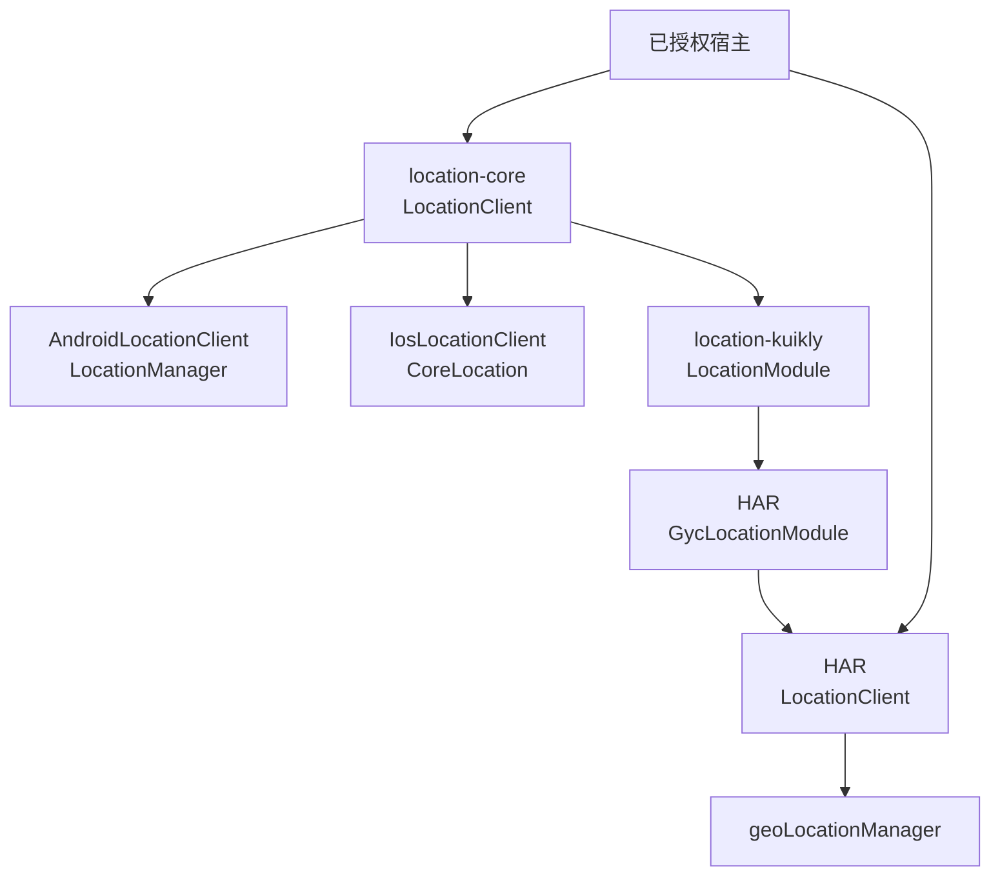
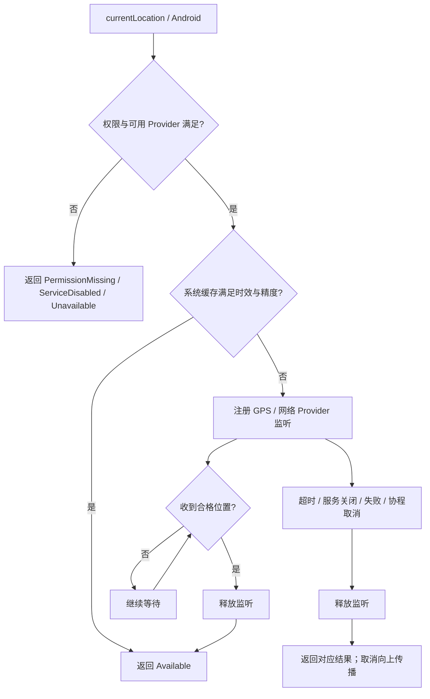
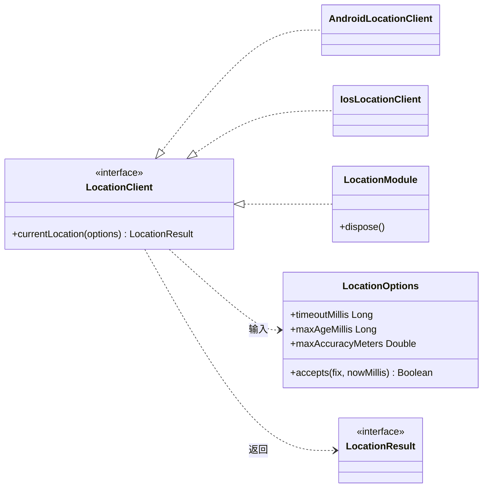

# GY CrossKit Location

## 当前功能与平台边界

core 提供前台单次定位、时效/精度过滤与取消；无地图或CMP UI，location-kuikly仅OHOS桥，A/i由宿主两套UI复用原生实现。

适用版本：Maven 0.1.5；HAR 0.1.4。本次修复与平台边界见[功能与平台差异](docs/功能与平台差异.md)，构建与渠道验收见[版本发布记录](https://github.com/gycrosskit/location/releases/tag/0.1.5)；下方旧版本记录保留其历史范围。

当前测试覆盖、执行时点和未验收项集中见[验证范围](docs/功能与平台差异.md#验证范围)，复现命令见[开发与验证](docs/开发与验证.md)。

此版本包含已复核的跨端行为修复；[历史源码候选记录](docs/跨端行为候选.md)和下方旧版验收保持其原时点，当前范围见顶部功能与平台差异。

[历史完整源码审查](docs/完整源码审查.md) 列出全部生产文件、公开调用链、实际验证与未测项。

前台单次定位，提供权限/服务状态、取消、超时、缓存时效和精度过滤。保留系统原始坐标；权限申请、地址查询、坐标转换和业务精度要求由宿主负责。

## 0.1.1 历史 prerelease

当时 Maven/HAR 候选为 0.1.1，[prerelease 已发布](https://github.com/gycrosskit/location/releases/tag/0.1.1)，实际下载 SHA 与 JitPack 全 9 个 module 的文件引用校验通过。独立真实 JitPack Android/JVM/OHOS/iOS 编译及 Simulator 最终链接、Release HAR 独立编译通过；该段为 0.1.1 历史验收；当前安装版本及状态见本页前部，设备定位尚未验收。

以下为历史 0.1.1 查询状态：OHPM `next` 提交已接受，仍在审核；精确版本查询及独立 Registry 安装返回 NOTFOUND。稳定 Registry `latest` 仍为 0.1.0，Release HAR 可下载不代表 Registry 可安装。

## 0.1.2 历史 prerelease

Kuikly watchdog 以请求期限加 2 秒回执余量、构造器指定最短等待中的较大者结算，避免提前截断长请求；超时明确返回 TimedOut，空原生回执保持 Unavailable。现有 10 秒请求/12 秒桥接等待保持。

| 渠道 | 当时版本 | 历史状态 |
| --- | --- | --- |
| Maven core/Kuikly | 0.1.2 | JitPack 全文件/hash 与 Android/OHOS/三 iOS 编译、Simulator 链接通过 |
| HarmonyOS HAR | 0.1.1 | 原生源码未变，沿用旧 Release 已验产物 |


## 平台与要求

| 平台 | 接入方式 | 系统要求 |
| --- | --- | --- |
| Android | KMP `location-core`，`LocationManager` | API 24+ |
| iOS | KMP `location-core`，`CoreLocation` | iOS 14+（使用实例 `authorizationStatus` API） |
| HarmonyOS | 原生 `location-native` HAR，`geoLocationManager` | 当前 HAR 的 target/compatible SDK 均为 API 22 |

KMP 使用 Kotlin `2.2.21-1.0.0`、coroutines `1.10.2`。稳定 0.1.0 无 Kuikly/OHOS KMP 桥；历史 0.1.1 新增 `location-kuikly` 与 core 的 `ohosArm64` 变体。不提供 Swift Package；JVM 变体只含公共 API/数据与测试逻辑，无 JVM 定位实现。

## 0.1.3 发布状态

Maven core/Kuikly `0.1.3` 已提供 GitHub 预发行，JitPack 的精确标签/提交、完整 publication 和实际文件校验通过。Release HAR 已重下载校验；OHPM 以独立 `candidate-0.1.3` 标签提交审核，精确 Registry 安装仍返回 NOTFOUND，旧 next 保持。全新远程 Maven 的 Android/iOS/OHOS 消费与 Simulator Framework 链接已通过，另含 JVM 编译。详情见[0.1.3 发布验收](docs/0.1.3发布验收.md)。

iOS 等待定位期间授权改为 `Restricted` 与 `Denied` 均返回 `PermissionMissing`；HAR 不允许负 Unix 时间戳通过较大的缓存预算变成有效读数。原生权限/设置差异与既有版本发布状态保持下文记录。

## 架构与调用流程

`location-core` 统一单次定位参数与结果，权限由宿主提前取得。Android/iOS 使用各自系统定位实现；HarmonyOS 可直接使用 HAR，或经 `location-kuikly` 接线。JVM 只有公共 API，没有系统定位实现。



Android 的单次请求先检查权限、服务和合格缓存；只有需要新位置时才注册监听。结束后释放监听，协程取消继续向上传播。iOS 与 HAR 使用各自系统监听及缓存来源，具体实现见源码。



类图展示 KMP 契约；HarmonyOS ArkTS 的同名 `LocationClient` 是独立原生类，不是 Kotlin 接口的直接实现。



源码：[公共类型](location-core/src/commonMain/kotlin/io/github/gycrosskit/location/Location.kt)、[Android 实现](location-core/src/androidMain/kotlin/io/github/gycrosskit/location/AndroidLocationClient.kt)、[iOS 实现](location-core/src/iosMain/kotlin/io/github/gycrosskit/location/IosLocationClient.kt)、[Kuikly Module](location-kuikly/src/commonMain/kotlin/io/github/gycrosskit/location/kuikly/LocationModule.kt)、[HAR Module](ohos/location-native/src/main/ets/GycLocationModule.ets)、[HAR Client](ohos/location-native/src/main/ets/LocationClient.ets)。Kuikly 的取消、超时和 `dispose()` 按 requestId 取消对应原生请求；回执后也会再次检查页面是否销毁。

## 安装

```kotlin
// settings.gradle.kts
dependencyResolutionManagement {
    repositories {
        maven("https://jitpack.io")
        maven("https://maven.eazytec-cloud.com/nexus/repository/maven-public/")
        google()
        mavenCentral()
    }
}
```

```kotlin
commonMain.dependencies {
    implementation("com.github.gycrosskit.location:location-core:0.1.5")
}
ohosArm64Main.dependencies {
    implementation("com.github.gycrosskit.location:location-kuikly:0.1.5")
}
```

HarmonyOS 原生包独立安装，候选正式可查询后执行；发布接受与 Registry 可安装分别核验：

```sh
ohpm install @gycrosskit/location-native@0.1.4
```

## 最小使用

```kotlin
import io.github.gycrosskit.location.*

val client: LocationClient = AndroidLocationClient(context)
// iOS 平台入口用 IosLocationClient()。
// 先取得权限，再在页面生命周期绑定的协程中调用：
val result = client.currentLocation(LocationOptions(
    timeoutMillis = 12_000,
    maxAgeMillis = 300_000,
    maxAccuracyMeters = 100.0,
))
when (result) {
    is LocationResult.Available -> {
        val latitude = result.fix.latitude
        val longitude = result.fix.longitude
        // 交给宿主使用，fix 还包含精度和 Unix 毫秒时间。
    }
    LocationResult.PermissionMissing -> { /* 申请权限或展示引导 */ }
    LocationResult.ServiceDisabled -> { /* 展示系统定位服务引导 */ }
    LocationResult.TimedOut, LocationResult.Unavailable -> { /* 提示重试 */ }
}
```

HarmonyOS 的 `LocationClient.currentLocation` 返回带 `result` Promise 和 `cancel()` 的请求，见接入指南。

## 权限与生命周期

Android 声明并取得 `ACCESS_COARSE_LOCATION` / `ACCESS_FINE_LOCATION`；iOS 填写 `NSLocationWhenInUseUsageDescription` 并提前授权；HarmonyOS 申请 `ohos.permission.APPROXIMATELY_LOCATION`，精确定位另加 `ohos.permission.LOCATION`。

库不将粗略授权直接判失败，位置满足 `maxAccuracyMeters` 才返回成功；拒绝非法经纬度、未来/过期坐标和不合格精度。KMP 请求协程取消会清理独占系统监听，保留取消语义；完成和超时同样清理。iOS 平台操作内部切换主线程。Android 同时监听已启用的 GPS/网络 Provider，接受第一份合格位置。

HarmonyOS 页面销毁时调用请求 `cancel()`；优先复用实例内的合格位置，否则读取系统上次位置；无历史位置或时效/精度不合格时等待新读数。每次读取重新检查权限、服务、时效和精度，不持久化位置。不提供后台或持续定位。GPS、室内/室外、权限和后台生命周期需真实设备验收。

## 文档与帮助

- [接入指南](docs/接入指南.md)：平台初始化、权限声明和生命周期。
- [开发与验证](docs/开发与验证.md)：源码构建、检查命令与验收范围。
- [版本与发行说明](https://github.com/gycrosskit/location/releases)、[问题反馈](https://github.com/gycrosskit/location/issues)。

Apache-2.0，见 [LICENSE](LICENSE)。

## 0.1.1 候选：Kuikly 单次定位

新增 `location-kuikly` 与原生 `GycLocationModule`，每个Page各注册一个对应Module。
Maven 显式选择 `location-core:0.1.1`，OHOS 额外依赖 `location-kuikly:0.1.1`，原生 HAR 为 `@gycrosskit/location-native@0.1.1`。Maven 已完成远程文件校验，OHPM 可安装性按上方独立状态记录。

```kotlin
val location = io.github.gycrosskit.location.kuikly.LocationModule(bridgeTimeoutMillis = 12_000)
val result = location.currentLocation(LocationOptions(timeoutMillis = 10_000, maxAgeMillis = 300_000, maxAccuracyMeters = 500.0))
// pageWillDestroy: location.dispose()
```

宿主映射业务坐标/结果；协程取消、超时和dispose同时取消原生定位，旧请求ID不能停止后继请求。原生Client验证系统时间、缓存和精度；组件不弹权限申请、不转换坐标系。
`location-core` 新增OHOS变体；发布时同时核验原Android/iOS/JVM消费者，不能只验证新Kuikly模块。

本轮制品校验与远程状态见 [0.1.3 发布验收](docs/0.1.3发布验收.md)；历史记录见 [0.1.2 发布验收](docs/发布验收-0.1.2.md)。

## 自动回归

[Component regression](.github/workflows/regression.yml) 在 PR 和 `main` 更新时运行现有 Python/Node 契约测试、Android 单元测试及编译，以及 macOS 上的 iOS/OHOS KLIB 编译；已有 iOS、JVM、Kuikly 独立测试也按该 workflow 执行。Release 发布或手动指定不可变版本后，校验 Release Maven 归档的 SHA-256、POM、metadata 与文件引用，并从 JitPack 独立编译 Android 消费者、链接 iOS 消费者、编译 OHOS Kuikly 消费者。此流程不发布二进制。

OHOS KLIB 编译不代表 HAR 构建、ohpm 上架或真机验收。当前没有已确认可用的 DevEco/Hvigor runner，这些检查尚未自动化，不能作为 CI 通过范围。

PR 的发布回归固定验证已发布 `0.1.3` 基线，五个 job 都通过后才合并；Release 事件使用其精确标签。基线证明远程产物可消费，不代表 PR 新源码已发布。

已发布 `0.1.3` 的 iOS KLIB 引用了 SDK 26 的 `_LocationEssentials`，独立 Framework 链接需要 Xcode 26/iOS SDK 26；`release-native` 明确选择 runner 已安装的 Xcode 26.0.1 并打印版本/SDK 清单。该构建 SDK 门槛不提高组件现有 iOS 14+ 的 deployment target，也不新增系统 API。
